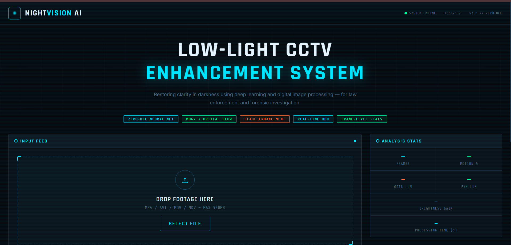
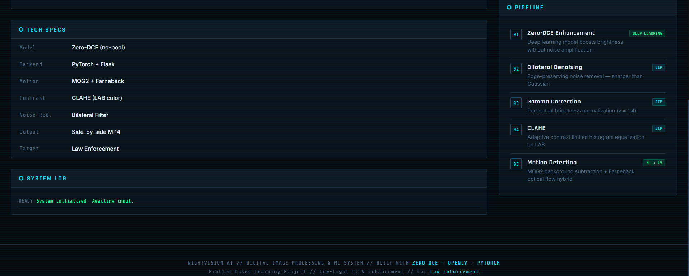
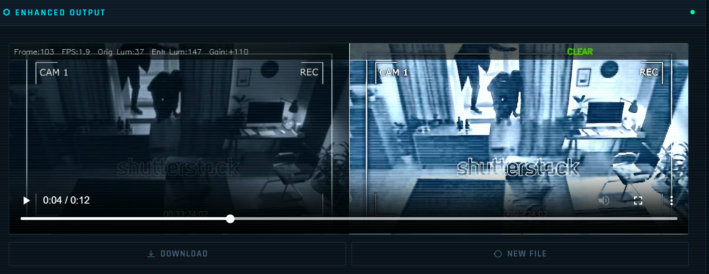
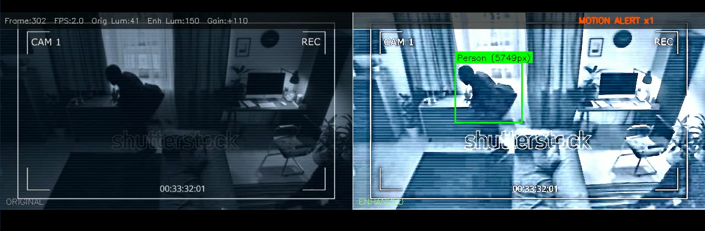
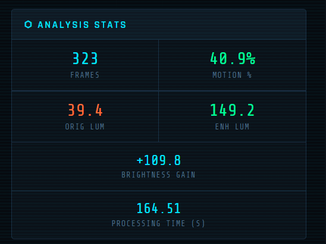
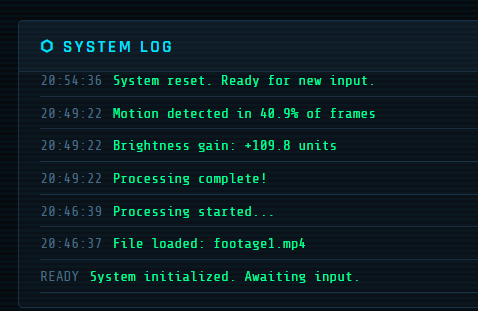

# 🌙 NightVision AI — Intelligent Low-Light CCTV Enhancement

> **Deep Learning + Computer Vision for Forensic Video Enhancement**  
> Restore clarity in darkness using Zero-DCE neural networks, advanced image processing, and intelligent motion detection.


---

## 📋 Overview

**NightVision AI** is a **Flask web application** designed for law enforcement and forensic investigation teams to enhance low-light CCTV footage. It uses:

- **Zero-DCE** — Deep learning model for brightness enhancement without noise amplification
- **MOG2 + Optical Flow** — Hybrid motion detection to identify suspects and vehicles
- **CLAHE** — Adaptive contrast enhancement for edge details
- **Bilateral Filtering** — Edge-preserving denoising
- **Real-time HUD** — Side-by-side comparison with metadata overlay

### Key Features

✨ **Enhancement Pipeline**

- Zero-DCE deep learning enhancement
- Bilateral denoising (edge-preserving)
- Gamma correction (γ = 1.4)
- CLAHE contrast enhancement
- Sharpening filter

🎯 **Motion Detection**

- MOG2 background subtraction
- Farnebäck optical flow confirmation (reduces false positives)
- Classification: Vehicle, Person, Object
- Aspect ratio filtering (removes thin artifacts)

📊 **Real-Time Analytics**

- Live frame progress tracking
- Brightness gain calculation
- Motion percentage metrics
- Processing time statistics
- Side-by-side original vs. enhanced comparison

🎨 **Modern UI**

- Cyberpunk-inspired dark theme
- SSE live progress streaming
- Drag-and-drop file upload
- Interactive stats dashboard
- System activity log

---

## 📷 Screenshots

### Landing Page (Top)



---

### Landing Page (Bottom)



---

### Output Comparison 1



---

### Output Comparison 2



---

### Analysis Dashboard



---

### System Log



---

## 🛠️ Tech Stack

| Component    | Technology                 |
| ------------ | -------------------------- |
| **Backend**  | Flask 2.x + PyTorch 2.0    |
| **Frontend** | HTML5, CSS3, Vanilla JS    |
| **CV/DL**    | OpenCV 4.x, PyTorch, NumPy |
| **Video**    | FFmpeg, OpenCV VideoWriter |
| **Server**   | Python 3.8+                |

---

## 📁 Project Structure

```
cctv-video-enhancement/
├── app.py                      # Flask backend (enhancement pipeline + routes)
├── requirements.txt            # Python dependencies
├── .gitignore
├── LICENSE
├── README.md
|
|
|──images/
|   ├── landing_page_top.png
|   └── landing_page_bottom.png
|   └── output_comparison1.png
|   └── output_comparison2.png
|   └── analysis_stats.png
|   └── systemlog.png
|
│
├── model/
│   ├── model.py               # Zero-DCE architecture (enhance_net_nopool)
│   └── weights.pth            # Pre-trained weights (~50MB)
│
├── static/                     # Static assets (auto-created directories)
│   ├── css/
│   │   └── style.css          # Cyberpunk UI styling
│   ├── js/
│   │   └── main.js            # Frontend logic (file upload, SSE, video player)
│   ├── uploads/               # Temp folder for uploaded videos (auto-created)
│   └── output/                # Processed videos (auto-created)
│
└── templates/
    └── index.html             # HTML template (rendered by Flask)
```

---

## 🚀 Installation & Setup

### Prerequisites

- **Python 3.8+**
- **CUDA 11.8+** (optional, for GPU acceleration)
- **FFmpeg** (required for MP4 conversion)

### Step 1: Clone the Repository

```bash
git clone https://github.com/DaleG16/cctv-video-enhancement.git
cd cctv-video-enhancement
```

### Step 2: Install Dependencies

```bash
pip install -r requirements.txt
```

**For GPU support (CUDA 11.8):**

```bash
pip install torch torchvision torchaudio --index-url https://download.pytorch.org/whl/cu118
```

**For CPU only:**

```bash
pip install torch torchvision torchaudio
```

### Step 3: Install FFmpeg

**macOS (Homebrew):**

```bash
brew install ffmpeg
```

**Ubuntu/Debian:**

```bash
sudo apt-get install ffmpeg
```

**Windows (Chocolatey):**

```bash
choco install ffmpeg
```

### Step 4: Download Pre-trained Weights

Download the Zero-DCE model weights and place in `model/weights.pth`:

- [Zero-DCE Weights](https://github.com/Li-Chongyi/Zero-DCE) (~50MB)

Alternatively, if weights are included in repo (large file):

```bash
# Weights are tracked via Git LFS
git lfs install
git lfs pull
```

### Step 5: Run the Application

```bash
python app.py
```

Navigate to: **http://localhost:5000**

---

## 💻 Usage

### Basic Workflow

1. **Upload**: Drag-and-drop a video file (MP4, AVI, MOV, MKV) — max 500MB
2. **Process**: Click "ENHANCE & ANALYZE"
3. **Monitor**: Watch live progress (0–100%) with stage indicators
4. **Review**: View side-by-side comparison with stats
5. **Download**: Save the enhanced MP4 video

### Supported Formats

**Input:** MP4, AVI, MOV, MKV (any OpenCV-compatible format)  
**Output:** MP4 (H.264 codec)  
**Max Size:** 500MB

### Example Output

The processed video shows:

- **Left half**: Original (dark) footage
- **Right half**: Enhanced footage with motion detection bounding boxes
- **HUD overlay**: Frame count, FPS, brightness metrics, motion status

---

## 📊 Processing Pipeline

```
INPUT VIDEO
    ↓
[1] Zero-DCE Enhancement      → Deep learning brightness boost
    ↓
[2] Bilateral Denoising        → Edge-preserving noise removal
    ↓
[3] Gamma Correction (γ=1.4)   → Perceptual brightness normalization
    ↓
[4] CLAHE Enhancement          → Adaptive contrast on LAB color space
    ↓
[5] Sharpening Filter          → Edge enhancement
    ↓
[6] Motion Detection            → MOG2 + Optical Flow (hybrid)
    ↓
[7] HUD Rendering              → FPS, brightness, motion labels
    ↓
[8] Side-by-Side Composition   → Original vs Enhanced
    ↓
[9] AVI Export                 → Frame-by-frame writing
    ↓
[10] MP4 Conversion            → FFmpeg H.264 encoding
    ↓
OUTPUT VIDEO
```

---

## ⚙️ Configuration

### Adjustable Parameters (in `app.py`)

#### Enhancement Tuning

```python
# Gamma correction (higher = brighter)
gamma_correction(enhanced, gamma=1.4)

# CLAHE contrast limiting
clahe = cv2.createCLAHE(clipLimit=3.0, tileGridSize=(8, 8))

# Bilateral filter (edge preservation)
cv2.bilateralFilter(frame, d=7, sigmaColor=75, sigmaSpace=75)
```

#### Motion Detection Tuning

```python
# MOG2 background subtractor
fgbg = cv2.createBackgroundSubtractorMOG2(
    history=300,           # How many frames to remember
    varThreshold=40,       # Sensitivity to changes
    detectShadows=False
)

# Optical flow threshold
flow_mask = (mag > 1.5).astype(np.uint8) * 255  # Adjust 1.5 for sensitivity

# Minimum contour area (pixels)
if area < 1500: continue  # Skip tiny noise

# Object classification by area
if area > 15000: label = "Vehicle"      # Large objects
elif area > 5000: label = "Person"       # Medium objects
else: label = "Object"                   # Small objects
```

#### Video Output Tuning

```python
# Max width (maintains aspect ratio)
target_w = min(640, src_w)

# H.264 quality (0-51, lower = better, slower)
crf=23
```

---

## 📈 Performance

\__Performance benchmarked on an ASUS TUF Gaming A17 (AMD Ryzen 7 4800H, NVIDIA GeForce RTX 3050 Laptop GPU). Actual performance may vary depending on input video resolution and hardware._

---

## 🐛 Troubleshooting

### Issue: "Model weights not found"

**Solution:** Download weights and place in `model/weights.pth`

### Issue: "ffmpeg command not found"

**Solution:** Install FFmpeg (see Installation step 3)

### Issue: Video upload fails with 413 error

**Solution:** Max file size is 500MB. Check `app.config["MAX_CONTENT_LENGTH"]`

### Issue: Slow processing on CPU

**Solution:** Use GPU if available, or reduce resolution:

```python
target_w = min(480, src_w)  # Lower resolution = faster
```

### Issue: Motion detection too sensitive

**Solution:** Increase area threshold or optical flow threshold:

```python
if area < 2500: continue          # Increase from 1500
flow_mask = (mag > 2.0).astype(...)  # Increase from 1.5
```

---

## 🔬 Model Details

### Zero-DCE (Zero-Reference Deep Curve Estimation)

- **Research Paper:** [Learning to Enhance Low-Light Image via Zero-Reference Deep Curve Estimation](https://arxiv.org/abs/2001.06826)
- **Purpose:** Enhances each extracted video frame individually.
- **Architecture:** Lightweight CNN with no reference image required.
- **Input:** Individual RGB video frame normalized to [0,1].
- **Output:** Enhanced video frame with improved brightness while preserving details.
- **Advantage:** No paired training data required and generalizes well to diverse low-light scenes.

### Training Data

The pretrained Zero-DCE model used in this project was originally trained on low-light image datasets, including:

- LOL dataset (Low-Light)
- 500 real-world low-light scenes
- 500 synthetic paired examples

---

## 📝 License

This project is licensed under the **MIT License** — see [LICENSE](LICENSE) for details.

Commercial use is permitted with attribution.

---

## 🤝 Contributing

Contributions are welcome! Please:

1. Fork the repository
2. Create a feature branch: `git checkout -b feature/your-feature`
3. Commit changes: `git commit -m "Add feature"`
4. Push: `git push origin feature/your-feature`
5. Open a Pull Request

### Areas for Contribution

- [ ] Batch processing (multiple videos)
- [ ] REST API endpoint for integration
- [ ] Docker containerization
- [ ] Mobile app (React Native)
- [ ] Advanced UI filters (brightness, contrast sliders)
- [ ] Additional models (R2D2, EnlightenGAN)

---

## 📚 References

1. **Zero-DCE**: Li et al. (2020) — [arXiv:2001.06826](https://arxiv.org/abs/2001.06826)
2. **MOG2**: Zivkovic et al. — [IEEE Trans. PAMI](https://ieeexplore.ieee.org/)
3. **Optical Flow**: Farnebäck (2003) — [CVPR](https://www.diva-portal.org/smash/record.jsf?pid=diva2:273589)
4. **CLAHE**: Zuiderveld (1994) — [Graphics Gems IV](https://www.graphicsgems.org/)

---

## 👤 Author

**Dale Chris**  
Problem-Based Learning Project  
For Law Enforcement & Forensic Investigation

Contact: [dalemenezes2005@gmail.com](mailto:dalemenezes2005@gmail.com)  
GitHub: https://github.com/DaleG16

---

---

## ⭐ If you found this helpful, please star the repository!

---
